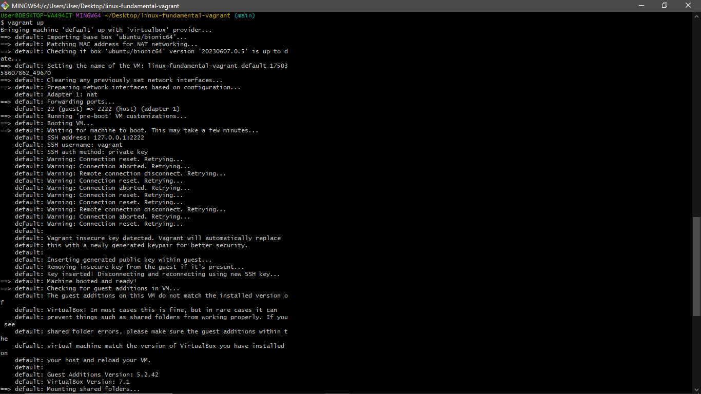
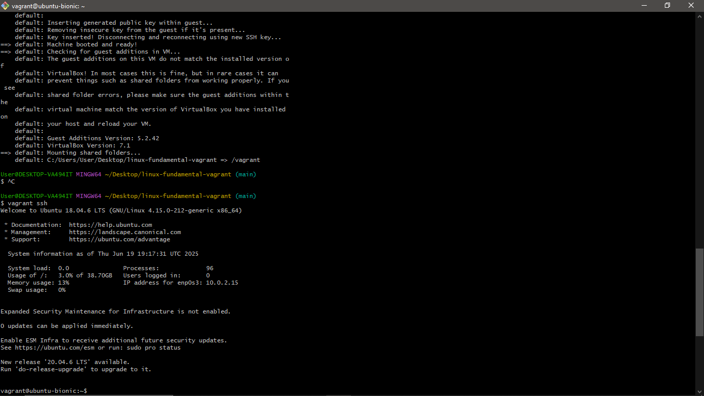
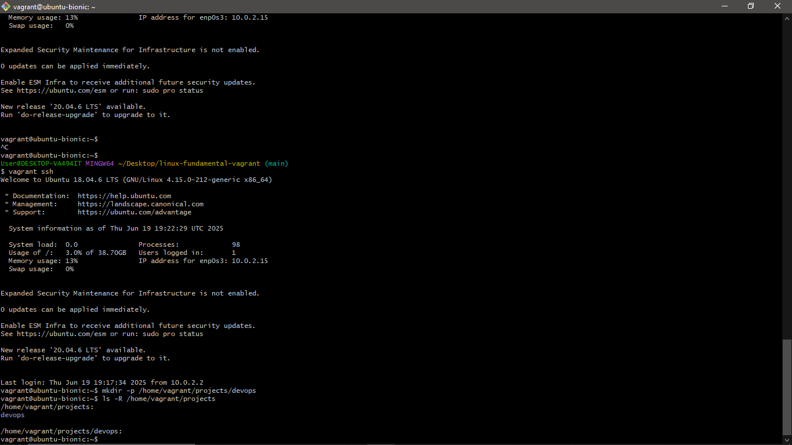
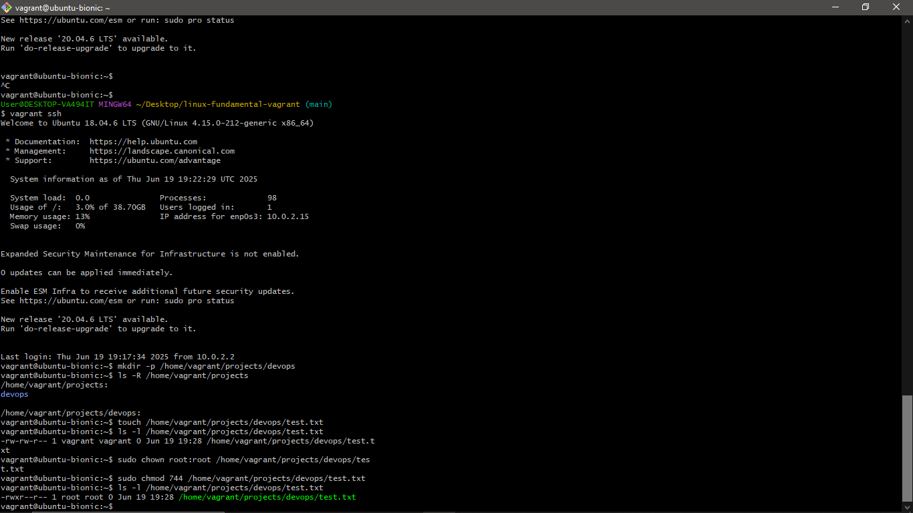
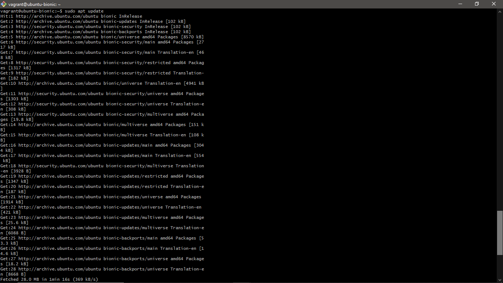
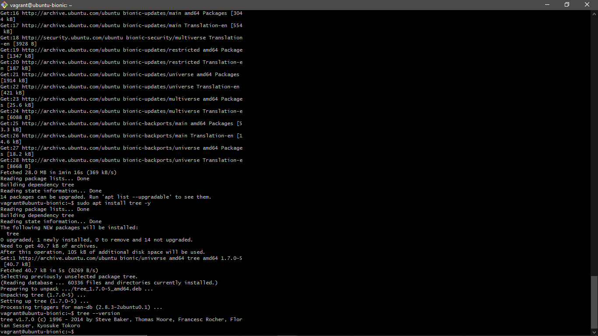
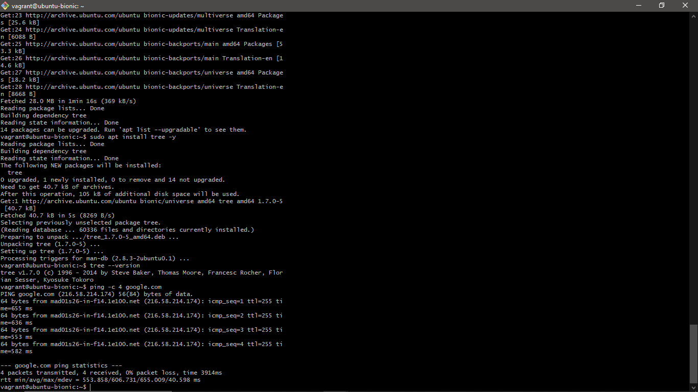

# 🐧 Linux Fundamentals with Vagrant

This is a beginner-friendly DevOps project that demonstrates how I set up and manage a virtualized Linux environment using Vagrant and VirtualBox. It covers core Linux system administration skills such as navigating the file system, managing permissions, installing packages, and testing connectivity.

---

## 🧰 Tools I Used Include

- **Vagrant** (to provision a virtual machine)
- **Oracle VirtualBox** (to run the VM)
- **Ubuntu 18.04 LTS** (using the guest OS)
- **Git Bash** (as my local CLI on Windows)

---

## 📁 Project Structure
```
linux-fundamentals-vagrant/
├── Vagrantfile
├── README.md
├── screenshots/
│   ├── task1a.png
│   ├── task1b.png
│   ├── task2.png
│   ├── task3.png
│   ├── task4a.png
│   ├── task4b.png
│   └── task5.png
├── Other folders and files
```


---

## 📝 Tasks Overview

## 📦 Repository Setup

I created a new public GitHub repository named `linux-fundamentals-vagrant` to document and track progress for this project. It contains a `README.md` file for detailed task descriptions and a `screenshots/` folder for all required visuals.


### ✅ Task 1: Setting Up a Vagrant Server

### 📸 Screenshot 1: Vagrant Init & SSH


- Description
> This screenshot shows the process of initializing a Vagrant project, starting the virtual machine, and logging into the Ubuntu server via SSH. This confirms that the VM is up and running, ready for Linux administration tasks.

To begin, I used Vagrant to set up a virtual machine running Ubuntu 18.04. I initialized the environment with `vagrant init`, booted the VM using `vagrant up`, and accessed it via SSH with `vagrant ssh`.

```bash
vagrant init ubuntu/bionic64
vagrant up
vagrant ssh
```
### ✅ Task 2: Exploring the Linux File System

### 📸 Screenshot 2: The created folder structure

> Inside the VM, a custom folder structure is created to simulate a DevOps project environment
> The structure `/home/vagrant/projects/devops` will house configuration files, scripts, and infrastructure code in real-world use.

-  Description of the structure created.
>  The directory path `/home/vagrant/projects/devops` is designed to simulate a real-world project workspace. 
> - `/home/vagrant/` is the default home directory for the `Vagrant` user.
> - `/projects/` acts as a container for multiple development projects.
> - `/devops/` represents a specific folder/project or environment related to infrastructure automation, DevOps-related tools, scripts, configuration files or CI/CD tasks.

Inside the Ubuntu VM, I explored the Linux directory structure and created a custom nested folder structure `/home/vagrant/projects/devops` to simulate a project workspace.

```bash
mkdir -p /home/vagrant/projects/devops
ls -R /home/vagrant/projects
```
### ✅ Task 3: Managing File Permissions and Ownership

### 📸 Screenshot 3: The permission and ownership change

> This screenshot shows the file test.txt before and after applying chown and chmod.
> root:root indicates that the file is now owned by the root user and group.
> 744 means the owner has full read, write, and execute permissions (rwx), while the group and others only have read access (r--).
> This is a common permission setup for executable scripts managed by root.

- The meaning of the permission and ownership values.
> The ownership `root:root` means the file is owned by the root user and root group.  
> The permission value `744` breaks down as follows:
> - `7` (owner): read (4) + write (2) + execute (1) = `rwx`
> - `4` (group): read only = `r--`
> - `4` (others): read only = `r--`  
> This means only the root user can modify or execute the file, while everyone else can only read it.


Inside the VM, I created a test file and used `chown` to change its ownership and `chmod` to modify its permission settings.
```bash
touch /home/vagrant/projects/devops/test.txt
ls -l /home/vagrant/projects/devops/test.txt
sudo chown root:root /home/vagrant/projects/devops/test.txt
sudo chmod 744 /home/vagrant/projects/devops/test.txt
ls -l /home/vagrant/projects/devops/test.txt
```
### ✅ Task 4: Installing and Configuring a Package

### 📸 Screenshot 4: Package being installed and version confirmation


>This screenshot shows the process of updating package lists, installing the `tree` package, and verifying the installation by checking its version. This confirms that the system can successfully manage software using `apt`.

Inside the Ubuntu VM, I used the Advanced Package Tool (`apt`) to install a basic package called `tree`. This utility allows visualizing directory structures in a tree-like format. After installation, I confirmed the version to verify it was installed correctly.

```bash
sudo apt update
sudo apt install tree -y
tree --version
```
### ✅ Task 5: Testing Remote Connectivity

### 📸 Screenshot 5: The ping result

> This screenshot output shows four successful responses from google.com, including packet round-trip times and no packet loss.
> This confirms that the virtual machine has a working network connection and can reach external servers — an essential capability for tasks like package installation, software updates, and remote access.

- What the output shows and why it’s useful
> The `ping` output shows that the VM successfully sent and received packets from `google.com` with 0% packet loss and acceptable response times.  
> This confirms that the VM has internet connectivity and that DNS resolution is functioning.  
> It's useful for troubleshooting network issues and ensuring the VM can access external resources like package repositories or APIs.

To test the VM’s network connectivity, I used the `ping` command to send ICMP echo requests to `google.com`. This helps verify that the VM has internet access and that DNS resolution is working properly.

```bash
ping -c 4 google.com
```
---

## ✅ Summary

This project demonstrates fundamental Linux system administration tasks in a virtualized environment using Vagrant and VirtualBox. Through this hands-on setup, I practiced:

- Provisioning a Linux VM with Vagrant
- Navigating and modifying the Linux file system
- Managing file permissions and ownership
- Installing and verifying software using `apt`
- Testing remote connectivity with `ping`

All tasks were documented with terminal commands and screenshots to reinforce understanding of basic DevOps and system administration workflows. This project lays the groundwork for more advanced DevOps tools and cloud-based infrastructure management.
